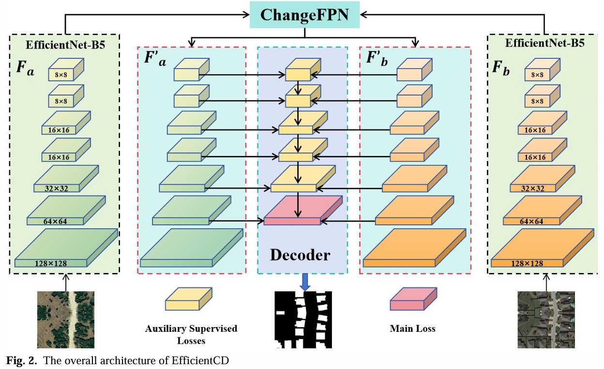
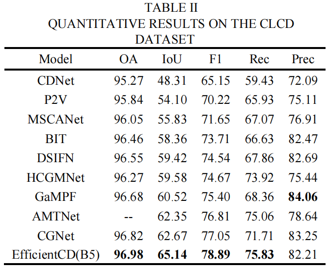
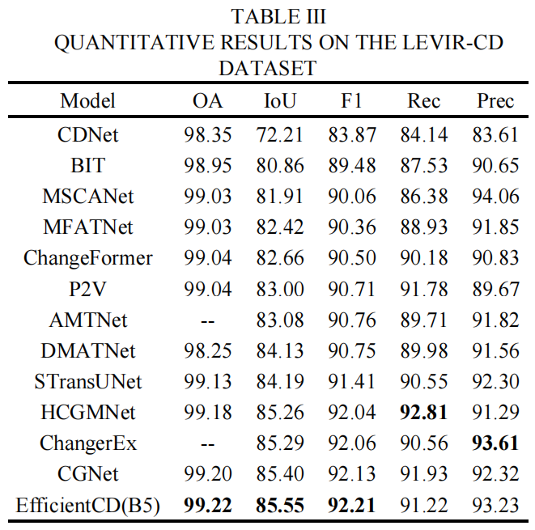
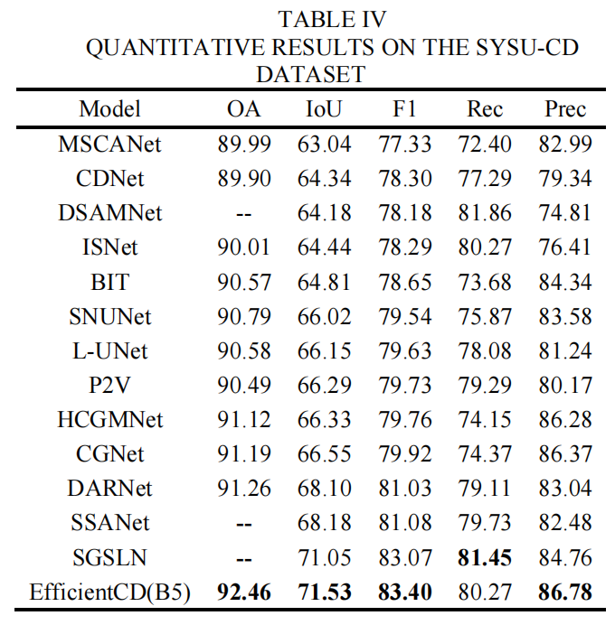
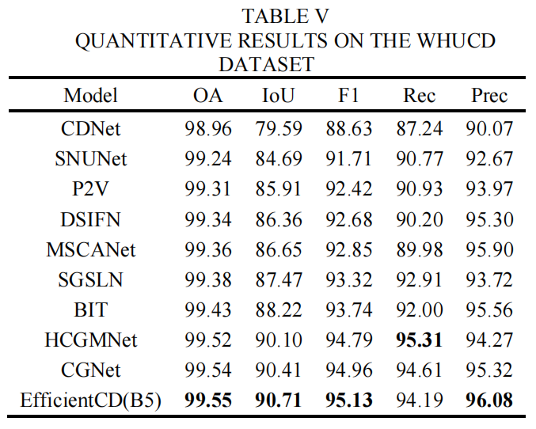

The Pytorch implementation for:
“EfficientCD: A New Strategy For Change Detection Based With Bi-temporal Layers Exchanged[]([[2407.15999/] EfficientCD: A New Strategy For Change Detection Based With Bi-temporal Layers Exchanged (arxiv.org)](https://arxiv.org/abs/2407.15999)),
[Sijun Dong](https://arxiv.org/search/cs?searchtype=author&query=Dong,+S), [Yuwei Zhu](https://arxiv.org/search/cs?searchtype=author&query=Zhu,+Y), [Geng Chen](https://arxiv.org/search/cs?searchtype=author&query=Chen,+G), [Xiaoliang Meng](https://arxiv.org/search/cs?searchtype=author&query=Meng,+X)::yum::yum:

[EfficientCD]([EfficientCD: A New Strategy For Change Detection Based With Bi-temporal Layers Exchanged | IEEE Journals & Magazine | IEEE Xplore](https://ieeexplore.ieee.org/document/10608163)) has been accepted in [IEEE TGRS]([IEEE Xplore: IEEE Transactions on Geoscience and Remote Sensing](https://ieeexplore.ieee.org/xpl/RecentIssue.jsp?punumber=36))




### Requirement  
 [env.yaml](env.yaml) 


## Revised parameters 
check the   [configs](configs) 

## Training, Test and Visualization Process   

```bash
bash tools/train.sh
```

## EfficientCD Pretrained Weights And Test Results

LEVIR-CD:  链接：https://pan.baidu.com/s/1epOgO-cw1gDsLdKwnb_Etw 
提取码：k7hu 

(This experimental setting is different from the experimental setting description of the LEVIR-CD dataset in the original paper. It adopts the same experimental setting method as the CLCD dataset, using random cutting training and sliding window prediction.)

WHUCD: 链接：https://pan.baidu.com/s/12_O_CdDemhidzNw1jJUwCA 
提取码：u1md 
CLCD: 链接: https://pan.baidu.com/s/1Ha4VR2KNhY0Mi7uaFinmWQ 提取码: viqe 










## Citation 

 If you use this code for your research, please cite our papers.  

```
@ARTICLE{10608163,
  author={Dong, Sijun and Zhu, Yuwei and Chen, Geng and Meng, Xiaoliang},
  journal={IEEE Transactions on Geoscience and Remote Sensing}, 
  title={EfficientCD: A New Strategy For Change Detection Based With Bi-temporal Layers Exchanged}, 
  year={2024},
  volume={},
  number={},
  pages={1-1},
  keywords={Feature extraction;Remote sensing;Task analysis;Computational modeling;Transformers;Biological system modeling;Land surface;Change detection;feature interaction;Euclidean distance},
  doi={10.1109/TGRS.2024.3433014}}
```
## Acknowledgments

 Our code is inspired and revised by [open-mmlab/mmsegmentation](https://github.com/open-mmlab/mmsegmentation),  [timm](https://github.com/huggingface/pytorch-image-models). Thanks  for their great work!!  
